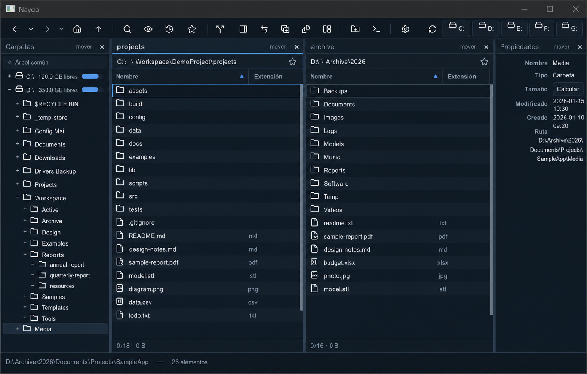
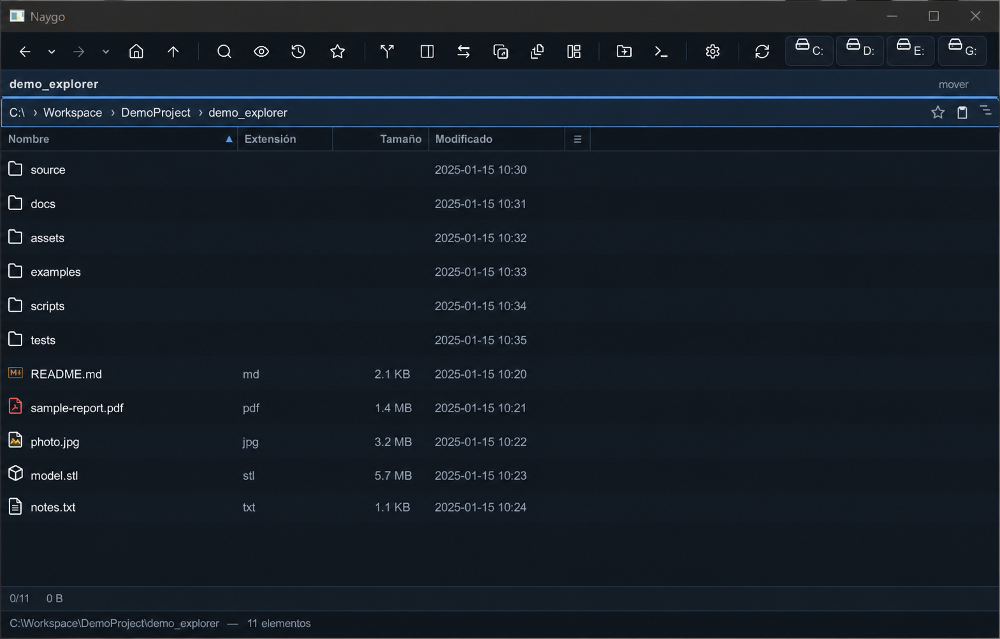

# Naygo

Un explorador de archivos rápido y liviano para Windows 10/11, estilo **Commander**
(inspirado en Directory Opus). Paneles dinámicos, navegación por teclado, diez idiomas
incluidos, temas y sets de íconos personalizables.

<p align="center">
  
</p>

<p align="center"><em>Ejemplo sintético: árbol, dos carpetas en paralelo y propiedades, todo en una sola ventana. Las rutas y nombres mostrados son ficticios.</em></p>

> **Estado:** UI en Slint (render por software, sin GPU). Funciona: multi-panel con
> redimensionado en vivo (mover un divisor solo afecta a sus dos vecinos; doble clic =
> 50/50), árbol de carpetas, columnas estilo planilla (orden + filtros), renombrado en
> línea y por lotes, plantillas de disposición (Layouts), búsqueda recursiva,
> previsualización (imágenes, SVG, PDF, texto/código, modelos STL/3MF y contenido de
> .zip/.tar/.tar.gz como árbol), sincronización de carpetas, bandeja temporal de archivos,
> conversión de texto, comprimir y extraer .zip, barra de unidades con espacio libre/usado y
> expulsión segura de USB, drag & drop (interno y con el sistema), abrir una terminal en
> la carpeta, configuración completa (incluido Acerca de + Avanzado), diez idiomas, sets
> de íconos personalizables, bandeja del sistema (la X esconde a la bandeja), atajo
> global Ctrl+Alt+Z para invocarlo, iniciar con Windows (directo a la bandeja)
> y navegación por teclado. La ventana recuerda su tamaño y posición.
>
> **Guía de uso:** [`docs/GUIA-DE-USUARIO.md`](docs/GUIA-DE-USUARIO.md) (o **F1** en la app).
> **Novedades por versión:** [`CHANGELOG.md`](CHANGELOG.md) (y la sección "Acerca de" muestra
> las de la versión instalada).

## Objetivos

- **Rápido ante todo.** Navegar entre carpetas se siente instantáneo, incluso con decenas de
  miles de archivos o discos de red lentos (listado por streaming incremental).
- **Estilo Commander.** Paneles dinámicos acoplables, dos (o más) carpetas a la vez, atajos
  de teclado para todo.
- **Personalizable.** Diez idiomas incluidos (es, en, pt, fr, de, it, zh, ja, ko, hi;
  agregar otro = soltar un archivo), temas con *color sets* intercambiables en caliente y
  sets de íconos configurables objeto por objeto.
- **Cancelable.** Cualquier operación larga (copiar, mover, listar, calcular tamaño) se puede
  detener al instante.
- **Liviano y robusto.** Bajo consumo, y nunca se cae porque un disco de red se desconecte.

## Funcionalidades

- **Puntos de comparación** desde Disposiciones o Ctrl+P: guardar metadatos y SHA-256 opcional,
  comparar más tarde con cobertura explícita y enviar cambios presentes a bandeja/entregas.
  Sin restauración de bytes ni indexador. [Guía de puntos](docs/PUNTOS-DE-COMPARACION.md).
- **Consultas guardadas multiraíz** desde F3 o Ctrl+P: filtros de nombre/contenido, tamaño y
  fechas relativas, ejecución explícita cancelable, resultados seleccionables y envío a bandeja.
  Sin indexador residente. [Guía de consultas](docs/BUSQUEDAS-GUARDADAS.md).
- **Espacios por tarea** desde Disposiciones o Ctrl+P: guardado explícito de paneles, rutas,
  columnas, filtros y bandeja; importar/exportar `.naygospace`, raíz portable y revisión antes
  de cambiar de tarea, sin interrumpir copias o movimientos. [Guía de espacios](docs/ESPACIOS.md).
- Navegación por paneles dual (o múltiples), con ir atrás/adelante (incluidos los botones
  laterales del mouse) y barra de ruta editable con favoritos.
- Árbol de carpetas con expansión incremental y revelado hasta la carpeta activa. Puede ser
  **común** para todos los paneles o **dedicado** a un Files; “Explorador enlazado” crea la
  pareja Árbol + Archivos ya agrupada y el vínculo se conserva al reiniciar.
- Columnas estilo planilla: ordenar, filtrar por tipo de columna y reordenar arrastrando.
- Operaciones entre paneles (copiar, mover, eliminar) con cola opcional, progreso y cancelación;
  los borrados grandes incluyen planificación y vista previa configurable.
- Asistente de sincronización recursiva entre dos paneles: izquierda→derecha,
  derecha→izquierda o bidireccional, con plan seleccionable y borrado de sobrantes
  desactivado por defecto.
- Bandeja temporal para reunir archivos de carpetas distintas y luego copiarlos, moverlos o
  enviarlos a la papelera como un solo lote. Ctrl/Shift y Ctrl+A marcan el conjunto; las acciones
  usan únicamente los marcados. Quitar referencias o vaciar no borra los archivos originales.
- **Preparar entrega** desde la bandeja o Ctrl+P: revisar los destinos, agrupar por origen,
  usar rutas relativas a una raíz explícita o archivos al mismo nivel, y publicar una carpeta
  nueva o un ZIP. Incluye manifiesto/lista sin rutas privadas y verificación SHA-256 opcional.
  Cancela desde Operaciones; deshacer retira únicamente el destino nuevo, no los originales.
  [Guía de entregas y límites](docs/ENTREGAS.md).
- **Recetas de operaciones** desde Disposiciones o Ctrl+P: reunir una selección o consulta,
  filtrar y preparar una carpeta/ZIP fechado. `.naygorecipe` guarda criterios reutilizables,
  con raíces/destino indicados por ejecución; nunca ejecuta al abrir ni modifica originales.
  [Guía de recetas](docs/RECETAS.md).
- Accesos físicos en el árbol a Escritorio, Documentos, Descargas, Imágenes, OneDrive y
  Dropbox; siguen funcionando aunque Windows o el proveedor los haya reubicado a otra unidad.
- Transformación segura de texto entre CRLF, LF y CR clásico; UTF-8/UTF-16, BOM, salto final
  y limpieza de espacios finales.
- Comprimir la selección en un `.zip` y extraer un `.zip` desde el menú contextual, en
  segundo plano, con progreso, cancelación y deshacer seguro.
- Renombrado en línea, en cadena y por lotes.
- Búsqueda F3 por nombre, patrón Windows (`*`, `?`) y texto dentro de archivos, con raíz
  editable, resultados incrementales y rutas relativas.
- Previsualización liviana: imágenes, SVG, PDF (texto y metadatos), texto/código, modelos
  3D STL/3MF rasterizados por CPU y contenido de archivos ZIP, TAR y TAR.GZ.
- Cálculo de tamaño de carpetas bajo demanda.
- Barra de unidades de disco con espacio libre/total y porcentaje usado; ícono propio para
  unidades USB y expulsión segura.
- Integración con Windows: menú contextual del shell, "Abrir con", ejecutar `.exe` como
  administrador con Shift o clic derecho, detección de cambios y de
  dispositivos, drag & drop —incluidos archivos virtuales desde 7-Zip/WinRAR—, bandeja del
  sistema y arranque opcional con el sistema.
- Sets de íconos: seis de fábrica (Lucide, Mono, Tabler, Material, Flat Color y Fluent),
  cambio de ícono por objeto (o un PNG propio) y packs `.naygoset` para compartir.
- Atajo global **Ctrl+Alt+Z** (configurable) que muestra Naygo y lo trae al frente desde
  cualquier aplicación.
- La **X** esconde a la bandeja del sistema (salir de verdad: menú de la bandeja); la
  ventana recuerda tamaño, posición y maximizado entre sesiones.
- Configuración completa: apariencia, atajos, previsualización, plantilla de tabla, opciones
  avanzadas y sección "Acerca de".

## De simple a multipanel

Naygo no obliga a trabajar siempre con una interfaz compleja. Una plantilla puede dejar solo
la carpeta actual para navegar con la máxima claridad, y otra puede reunir árbol, varios
paneles de archivos y propiedades para operaciones más exigentes.



Las disposiciones se pueden guardar y restaurar. El árbol puede ser común a todos los paneles
o estar enlazado a uno específico, para que cada zona de trabajo conserve su propio contexto.

## ¿Qué aporta Naygo?

| Necesidad | Naygo | Explorador de Windows | Gestores comerciales (en general) |
| --- | --- | --- | --- |
| Trabajar entre carpetas | Varios paneles dentro de una ventana | Pestañas o ventanas separadas | Habitualmente dos paneles |
| Adaptar el espacio de trabajo | Paneles dinámicos y disposiciones guardables | Disposición principalmente fija | Depende del producto |
| Árbol de directorios | Común o dedicado y enlazado a un panel | Un árbol por ventana | Depende del producto |
| Operaciones largas | Cola integrada, progreso, velocidad, cancelación y deshacer; también para borrados grandes | Diálogos separados del explorador | Habitualmente disponible |
| Confirmar un borrado grande | Planificación y vista previa opcional antes de ejecutar | Confirmación general | Depende del producto |
| Sincronizar dos carpetas | Plan previo, tres direcciones y eliminación opcional | Requiere operaciones manuales | Habitualmente disponible |
| Reunir archivos dispersos | Bandeja temporal entre carpetas | Selección limitada a la carpeta actual | Depende del producto |
| Revisar archivos de impresión 3D | Preview STL/3MF por CPU, sin abrir otra app | Sin preview STL/3MF nativo general | Depende de extensiones o del producto |
| Portabilidad y transparencia | Portable, código abierto MIT y sin telemetría | Integrado en Windows, código cerrado | Normalmente propietario y de pago |
| Equipos modestos y máquinas virtuales | Render por software, sin requerir GPU | Integrado con el sistema | Depende del producto |

Naygo no intenta reemplazar cada función especializada de las alternativas de pago. Su valor
está en concentrar el flujo cotidiano de navegar, comparar y operar archivos con rapidez, sin
suscripción, publicidad ni funciones que consuman recursos en segundo plano. Las prestaciones
de los gestores comerciales varían entre productos y versiones; la tabla resume categorías,
no pretende ser una comparativa exhaustiva.

## Stack

Rust + [Slint](https://slint.dev) (UI con renderizador por software, sin GPU) + el crate
oficial `windows` para la integración con el Shell de Windows. Open source, sin dependencias
de pago.

## Descargar

**[⬇ Descargar Naygo (portable)](https://github.com/nicolasgroth/explorador_archivos_naygo/releases/latest/download/Naygo-portable.zip)** — siempre apunta a la última versión publicada. También está el [instalador](https://github.com/nicolasgroth/explorador_archivos_naygo/releases/latest/download/Naygo-setup.exe).

## Instalación

- **Portable**: descarga `Naygo-<versión>-portable.zip`, descomprímelo y ejecuta `naygo.exe`.
  No instala nada.
- **Instalador**: ejecuta `Naygo-<versión>-setup.exe` y sigue el asistente (disponible en
  siete idiomas; incluye un paso para elegir el idioma inicial de Naygo entre los diez
  disponibles, preseleccionado según el idioma de Windows, y una casilla opcional "Iniciar
  Naygo al arrancar Windows"). Si ya tienes una versión instalada, el instalador la
  actualiza sin perder tu configuración.

La primera vez, Windows SmartScreen puede advertir "editor desconocido" (el `.exe` no está
firmado): haz clic en **"Más información" → "Ejecutar de todos modos"**.

## Compilar desde el código

Necesitas Rust (toolchain MSVC). Para compilar y empaquetar, consulta
[`docs/BUILD.md`](docs/BUILD.md) y [`docs/DISTRIBUTION.md`](docs/DISTRIBUTION.md).

Resumen:
- Compilar release: `cargo build --release` (el binario queda en `target/release/naygo.exe`).
- Empaquetar portable + instalador: `scripts\build-release.ps1`.
- Publicar una versión nueva: `scripts\bump.ps1` (sube la versión según los commits, mueve el
  CHANGELOG y crea el tag; agrega `-Push` para publicar).

## Uso por línea de comandos

`naygo.exe` acepta argumentos opcionales:

```
naygo.exe [<carpeta>] [--theme <id>] [--layout <nombre>] [--help] [--version]
```

- `<carpeta>`: abre Naygo en esa carpeta al iniciar (debe existir). Es lo que usa "Abrir en
  Naygo" del menú contextual del Explorador.
- `--theme <id>`: aplica un tema solo en esa sesión (no cambia tu configuración). Los ids son
  los temas de Configuración → Apariencia (p. ej. `dark-blue`, `winxp`, `macos`, `solarized-dark`).
- `--layout <nombre>`: aplica una plantilla de disposición de paneles (de las del menú Layouts,
  incluidas las tuyas).
- `--tray`: arranca minimizado en la bandeja (sin mostrar la ventana). Es el argumento que
  usa la entrada "Iniciar con Windows" cuando está activo "Iniciar minimizado en la
  bandeja"; si la bandeja está desactivada, se ignora sin efecto.
- `--help`, `--version`: muestran un cuadro con la ayuda o la versión.

Los valores que no existan se ignoran (la app abre igual y deja un aviso).

## Licencia

[MIT](LICENSE) © 2026 **Nicolás Groth / ISGroth**.

Libre de usar, modificar y distribuir. Si te sirve, se agradece mencionar a Nicolás Groth e
ISGroth.

Naygo usa software de terceros, cada uno bajo su propia licencia (todas permisivas; la interfaz
usa [Slint](https://slint.dev) bajo su licencia *royalty-free*). Los avisos están en
[`THIRD-PARTY-NOTICES.md`](THIRD-PARTY-NOTICES.md).
